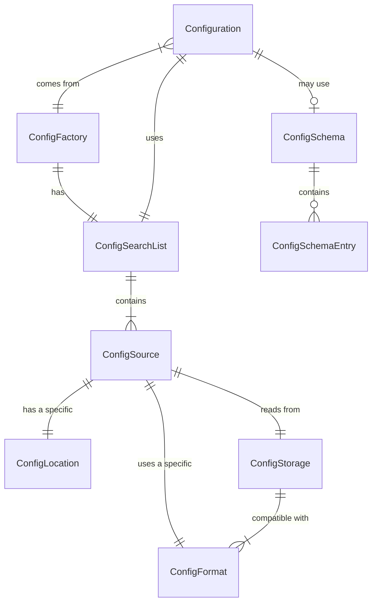
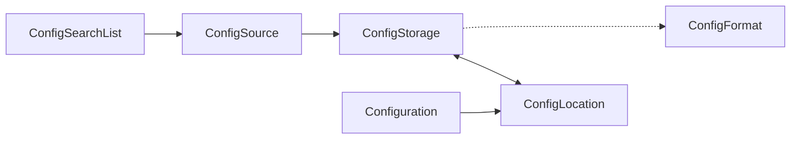

# 2.1 How it Works

To get library operation started, we need a lot of preparation and settings.
These are collected in a factory builder, `ConfigFactoryBuilder`,
which then builds a `ConfigFactory` with specific settings.

### Self-Configuration
Before the ConfigFactory is fully operational, it may perform "self-configuration".
If the `mConfigSourceJAR` module is active, the factory searches the classpath for:
`.config/metabit/mConfig/mconfig.properties`

This feature is enabled by default. It can be disabled by setting the `ENABLE_SELF_CONFIGURATION` flag to `false` in the `ConfigFactoryBuilder`.

Settings found in this file (or files, as it uses `ClassLoader.getResources()`) 
are used to populate the internal `ConfigFactorySettings`.
This allows the library to configure its own features 
(like enabling environment variable processing via `ALLOW_MCONFIG_RUNTIME_SETTINGS`) 
using its standard resource discovery layout.

The ConfigFactory in turn produces individual Configuration objects.

### 2-Phase Bootstrapping (Post-Initialization)
For advanced self-configuration, mConfig supports a 2-phase bootstrapping process. Once the `ConfigFactory` is fully initialized and the initial configuration stack is built, a `postInit(ConfigFactory)` hook is called on all registered `ConfigStorageInterface`, `ConfigSecretsProviderInterface`, `ConfigFactoryComponent`, and `ConfigLoggingInterface` modules.

The execution order for the `postInit` hook is deterministic:
1.  **`ConfigStorageInterface`**: Storages can use the factory for their own connection settings.
2.  **`ConfigSecretsProviderInterface`**: Secrets providers can fetch credentials from the now-ready storages.
3.  **`ConfigFactoryComponent`**: Administrative components (e.g., schema exporters) perform their tasks.
4.  **`ConfigLoggingInterface`**: The logger refines its configuration (e.g., remote endpoints) using the complete stack.

This allows modules to use the fully functional `ConfigFactory` to retrieve their own settings from any available source (including other modules) or perform post-startup administrative tasks. For example, a cloud storage module could use `postInit` to fetch its access credentials from a secrets provider that was initialized in the first phase, or a schema exporter component could automatically write discovered schemas to a specific directory. Advanced logging implementations can also use this hook to refine their remote endpoints or tokens using the fully resolved configuration hierarchy.

That's the startup phase; once that is done, you use the Configuration objects.

---
## Concept: Scopes
mConfig uses the concept of hierarchical **Scopes**. This determines the priority and visibility of configuration entries across different environments.

See the dedicated **[Scopes](20_scopes.md)** section for a detailed explanation of the scope hierarchy and its importance.

### Default scope and source hierarchy

Resolution priority between different storage types (within the same scope) is deterministic.

**Default Storage Priority (Highest to Lowest):**
1. `RAM` (In-memory overrides)
2. `secrets` (Encrypted/sensitive data)
3. `files` (Local filesystem)
4. `registry` (Windows Registry)
5. `registryjni` (Windows Registry JNI)
6. `zookeeper` (ZooKeeper module)
7. `JAR` (Classpath resources/defaults)

Use `STORAGE_TYPE_PRIORITIES` to change this order within a scope.

### Filesystem search paths (FileConfigStorage)

The lists below show the default search paths *as added to the search list*.
Earlier entries are preferred for **creation**; later entries override earlier ones
within the same scope. `SUB_PATH` (if set) is appended to the application paths.
`ADDITIONAL_*_DIRECTORIES` are prepended to their scope lists.

> **Optional Company Segment**: `<company>` omitted if `COMPANY_NAME` blank/null/whitespace (recommended but can be intentionally left blank for app-only paths). Examples below show both forms where applicable.

**Linux (and most Unix-like systems)**

HOST scope:
- `$XDG_CONFIG_DIRS` (default `/etc/xdg`), each entry: `<dir>/<app>`
- `/etc/opt/[<company>/]<app>/<subPath>`
- `/etc/opt/<app>/<subPath>`
- `/usr/local/etc/<app>/<subPath>`
- `/etc/<app>/<subPath>`
- `/etc/opt/[<company>/]` (broader HOST scope)
- `/etc/opt/` (broader HOST scope)
- `/usr/local/etc/` (broader HOST scope)
- `/etc/` (broader HOST scope)

USER scope:
- `$XDG_CONFIG_HOME/[<company>/]<app>/<subPath>` (if set)
- `~/.config/[<company>/]<app>/<subPath>`
- `~/.<app>/<subPath>`
- 
SESSION scope:
- `$PWD/.config/<app>/<subPath>`

**Windows**

SESSION scope:
- `%CD%\\.config\\<app>\\<subPath>`
- `%CD%` (legacy side-by-side .ini, .properties, etc.)

USER scope:
- `%XDG_CONFIG_HOME%\\<app>\\<subPath>` (if set)
- `%AppData%\\[<company>\\<]<app>\\<subPath>`
- `%LocalAppData%\\[<company>\\<]<app>\\<subPath>`
- `%UserProfile%\\.config\\<app>\\<subPath>`

APPLICATION scope:
- `<appDir>\\.config`
- `<appDir>`

HOST scope:
- `%ProgramData%\\[<company>\\<]<app>`
- `%AllUsersProfile%\\[<company>\\<]<app>`
- `%ProgramData%\\[<company>\\<]` (broader HOST scope)
- `%ProgramData%` (broader HOST scope)
- `%AllUsersProfile%\\[<company>\\<]` (broader HOST scope)
- `%AllUsersProfile%` (broader HOST scope)

**macOS (experimental)**

USER scope:
- `$XDG_CONFIG_HOME/[<company>/]<app>/<subPath>` (if set)
- `~/Library/Application Support/[<company>/]<app>/<subPath>`
- `~/Library/Preferences/[<company>/]<app>/<subPath>`
- `~/.<app>/<subPath>`

HOST scope:
- `/Library/Application Support/[<company>/]<app>/<subPath>`
- `/Library/Preferences/[<company>/]<app>/<subPath>`

APPLICATION scope:
- `<appDir>/.config`
- `<appDir>`

SESSION scope:
- `$PWD/.config/<app>/<subPath>`

**Android (experimental)**

APPLICATION scope:
- `/data/data/<app>/files/.config/<subPath>`
- `/data/data/<app>/files/<subPath>`

USER scope:
- `/data/data/<app>/files/<subPath>`
- `/storage/emulated/0/Android/data/<app>/files/.config/<subPath>` (if `EXTERNAL_STORAGE` set)
- `/storage/emulated/0/Android/data/<app>/files/<subPath>`

SESSION scope:
- `/data/data/<app>/cache/.config/<subPath>`
- Plus Linux-style fallbacks.

**Fallback (unknown OS)**

USER scope:
- `~/.<app>/<subPath>`

HOST scope:
- `$PWD/.config/<app>/<subPath>`


## The Process

### Layered Stack
When you ask for a ConfigEntry (or just its value) by providing a key, 
the library starts searching.
The normal method is using a layered stack, sorted by the aforementioned scopes.

At top, if enabled, is the cache layer, at RUNTIME scope.
Below it follow the other scopes, down to the PRODUCT scope, 
where you can find the defaults layer.

For each layer, the respective configuration source is asked whether it has
an entry matching the key. The topmost layer which has a valid entry wins,
and you get the ConfigEntry it has found.

If you asked for just the value, not the full ConfigEntry, then the library
tries to return the data found in the Java class matching the type of
value you asked for (e.g. Boolean, Integer, byte array).

### validation 
Note the mention of **valid** data.
You can, and should, provide a ConfigSchema which declares the expected
entries, and some information about them.

#### Schema Components
A schema entry typically includes:
- **Key**: The hierarchical name of the configuration entry.
- **Type**: The expected data type (e.g., `STRING`, `NUMBER`, `BOOLEAN`, `BYTES`, `DATE`, `DURATION`).
- **Default Value**: A fallback value used if the entry is missing from all other layers.
- **Description**: Documentation for the entry, used in reports and UI.
- **Flags**: Metadata like `MANDATORY`, `SECRET`, or `HIDDEN`.
- **Validation Rules**: Patterns or ranges (e.g., regex for strings, min/max for numbers) to ensure data integrity.

#### The Validation Process
When a configuration is accessed:
1. **Discovery**: The library searches for the key through the layered stack.
2. **Type Enforcement**: If a schema is active, the raw data from a `ConfigSource` is converted to the type specified in the schema. If conversion fails (e.g., "abc" for a `NUMBER`), the entry is considered invalid, and the search continues in lower priority layers.
3. **Constraint Checking**: The converted value is checked against validation rules (regex, ranges, enums).
4. **Outcome**:
   - **Valid**: The entry is returned and potentially cached.
   - **Invalid**: By default, the library logs a warning and skips the invalid entry, continuing the search in lower priority layers.
   - **Missing Mandatory**: If a `MANDATORY` entry is not found in any layer (including the default layer), a `ConfigException` is thrown upon access.

#### Schema Activation
When a `ConfigSchema` is activated for a `Configuration`:
- It populates the **Default Layer** (PRODUCT scope) with any default values defined in the schema.
- It provides the metadata required for automated documentation and schema export.
- It acts as a gatekeeper for all data entering the `Configuration` facade, ensuring type safety.

## Changes & Monitoring

There's two different aspects to changes.

First, getting notifications when the *value* of a config entry changes.
This is actively checking, even polling, for changes, to notify your code about
such events. It checks across different ConfigSources, formats, and the like.

mConfig provides a subscription mechanism via `subscribeToUpdates(Consumer<ConfigLocation>)`. 
This allows applications (and tools like the `mconfig monitor` command) to react
to configuration changes in real-time.

Second, the automated cache flush for some config sources. For most, reading is
not much effort; but certain ones - especially files and parsing their formats -
are not that cheap. So these are read, parsed, and then cached for some time.

But the cache should not stay indefinitely, it needs to detect changes and/or
refresh automatically. → `ConfigFeature.UPDATE_CHECK_FREQUENCY_MS`


## Behind the Scenes

mConfig uses these concepts for separation of concerns:

* ConfigSource is something where configurations come from. it returns Configuration instances.
 
* ConfigStorage is a concept representing an access medium, e.g. Filesystem, OS registry, network config services. It provides the technical access.

* ConfigFormat is how the configuration is structured and formatted inside the access medium.
  Files, specifically, come in a number of different formats; this handles the actual parsing.

* ConfigLocation: Represents the specific path/handle (the "Directory" part).


This is how it is supposed to be (and as of 0.6.x, isn't yet!)

```mermaid
erDiagram
    Configuration    }|--|| ConfigFactory : "comes from"
    ConfigFactory    ||--|| ConfigSearchList : has
    Configuration    ||--|| ConfigSearchList : uses
    ConfigSearchList ||--|{ ConfigSource : contains
    ConfigSource     ||--|| ConfigLocation : "has a specific"
    ConfigSource     ||--|| ConfigStorage : "reads from"
    ConfigSource     ||--|| ConfigFormat : "uses a specific"
    ConfigStorage    ||--|{ ConfigFormat : "compatible with"
    
    Configuration    ||--o| ConfigSchema : "may use"
    ConfigSchema     ||--o{ ConfigSchemaEntry : contains 
```


**Configuration** : the API interface to access configurations; produces/keeps ConfigEntry instances,
and provides simple access to the values.
They use their respective ConfigFactory search list, which consists of hierarchical and scoped
ConfigSource entries, to get ConfigEntry instances.

*An Configuration object is a way to access configurations in an uniform way.*

**ConfigSource** : this is ((supposed to be)) the combined ConfigStorage+ConfigFormat tuple,
instantiated, for active use. It can produce Configuration instances, which link back to it.

*A ConfigSource is where you can get a configurations from.*

**ConfigStorage** : Filesystem, Windows registry, Environment, networked system etc.
- this provides the (potentially OS-specific) access mechanisms to wherever configurations come from.

*A ConfigStorage is where configurations are stored.*

**ConfigFormat**  : Java-Properties, JSON, YAML, Windows registry, ...
- this maps general keys to storage-specific addressing, and
- performs format-specific conversions.

*A ConfigFormat is a format configurations are stored in.*


<blockquote>
 As of 0.6, there is a confusion between ConfigSource and ConfigStorage;
 also, the layer separation isn't clean yet.

 The ConfigSource would be the instance combination of several tuples;
 for example, using the FileConfigStorage, there would be a number of separate
 ConfigSource entries in the search list, each for a different directory.
 For the WindowsRegistryStorage, there's less of them (HKLM and so on);
 for the EnvironmentVariableStorage, there is probably just one.

 Whether ConfigSource will have different service-type instances is still open;
 the matching of Format and Storage is the tricky bit here.

 (( Should we present the available formats to the storages, ask them for compatibility?
   Should we do it the other way around? The interface between the two may be very
   specific. How to match them, and link them in a general way? ))

Situation as of 0.6
````mermaid
flowchart LR
    ConfigSearchList -->|contains several| ConfigLocationImpl
    ConfigLocationImpl -->|adds properties to| ConfigSourceInterface
    ConfigLocationImpl --> location
    ConfigLocationImpl --> flags
    ConfigSourceInterface --> FileConfigSource
    ConfigSourceInterface --> SchemaDefaultConfigSource
````
</blockquote>

Planned for 0.7


```mermaid
flowchart LR    
    ConfigSearchList --> ConfigSource
    ConfigSource  --> ConfigStorage
    ConfigStorage -..-> ConfigFormat
    ConfigStorage <--> ConfigLocation
    Configuration --> ConfigLocation
```

#### Anchor
The ConfigFactoryBuilder gathers and combines all the settings.
It creates a **ConfigFactoryInstanceContext** and a ConfigFactory to use it.

The ConfigFactoryInstanceContext is passed to several objects the ConfigFactory
uses, so they can get their respective features, settings, access to a logger,
and so on - it is an internally shared resource.


## Security and Secrets
mConfig has built-in support for sensitive data such as passwords, API keys, and private certificates.

### Secret Redaction
Config entries marked as secrets in the `ConfigSchema` are automatically handled with care:
- Their `toString()` representation is redacted (`[REDACTED]`). (using stars could be ambiguous)
- They are stored in specialized `SecretConfigEntryLeaf` objects.
- In-memory storage uses `byte[]` or `char[]` to allow for clearing the data after use.

### The SecretValue API
For programmatically accessing secrets, mConfig provides the `SecretValue` interface. 
This allows retrieving the sensitive data without it being accidentally converted to a standard `String` that might linger in the Java String Pool.

```java
SecretValue password = config.getSecret("database/password");
byte[] rawBytes = password.getValue();
// ... use and then potentially clear the bytes
```

## Binary Data (BLOBs)
Not all configuration is text-based. mConfig supports Binary Large Objects (BLOBs) for things like license files, binary keys, or certificates.

### Hierarchical BLOBs
In modern formats like JSON and YAML, binary data can be embedded directly.
- **YAML** uses the standard `!!binary` tag.
- **JSON** uses Base64 encoded strings. If a `ConfigSchema` is provided that marks a key as `BYTES` type, mConfig will automatically decode the Base64 string into a byte array.

### Flat Binary Files
For legacy support or specific use cases, an entire file can be treated as a single binary blob. This uses the `binary_file` format and is accessed via the empty string key (`""`).

```java
// Retrieving an entire .bin file as a single blob
Configuration licenseCfg = factory.getConfig("license");
byte[] licenseData = licenseCfg.getBytes("");
```


### Failure Handling

If there is no ConfigEntry found at any layer, and no specific default is found,
the reaction is determined by the ConfigFeature flags set.

(a) return a generic default value depending on the type
(b) throw ConfigException (runtime exception type)
(c) return "null" as ConfigEntry handle, your own code wants to handle the details.
— this will still cause an exception if you are asking for the value only. 

It is recommended, though, that you provide for each config entry you are reading
a default value which is sensible and useful in the context of your use case. 


