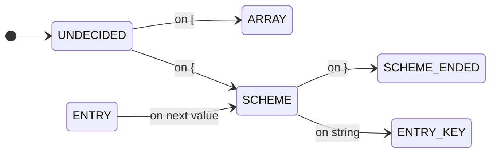

# 2.6 Extensions and Advanced Use

## 2.6.1 Using extensions

## 2.6.2 Advanced use

Why perform

* parameter validation, 
* checks for presence of mandatory settings,
* generation of parameter documentation
yourself? mConfig has a built-in facility for this and more. 

You describe all the entries your configuration can have,
and mConfig takes care of the checking. 

## 2.6.3 Data types
### 2.6.3.1 Config scheme formats
#### 2.6.3.1.1 Internal format 0: single ConfigSchemeEntry
    {
    "key":"mandatory key / configuration entry name",
    "TYPE":"mandatory type",
    "DEFAULT":"optional default value, as string",
    "DESCRIPTION":"optional description, for the documentation",
    "PATTERN":"optional validation pattern",
    "SCOPES":[ "optional", "scopes", "this", "is", "valid", "in"],
    "FLAGS":["flags","set":false,"if","present"],
    }

**@TODO allow an map for description as well, language->text**

(?) For FLAGS, we may chose an alternative form - each being a pair with string
key and boolean value.
#### 2.6.3.1.2 Internal format 1:  ConfigSchemes, in an array. internal use only!
    [ 
    SCHEME_ENTRIES,
    GO_HERE,
    DEFINED_AS_IN_FORMAT_1
    ]

#### 2.6.3.1.3 Format 2: full single ConfigScheme
    {
     "name":"mandatory name the Configuration is identified by",
     "entries":[ ENTRIES_AS_DEFINED_IN_FORMAT_2 ],
    }

#### 2.6.3.1.4 Format 3: multiple full ConfigSchemes
    [
      FULL_CONFIG_SCHEME_AS_DEFINED_IN_FORMAT_3
    ]

We expect

SCHEME_ENTRY until }
on closing scheme entry, add the currentEntry to currentScheme.
depending on level, change back...
on level 1, we're all done.
on level 2+ expecting next entry = inside SCHEME state

SCHEME and }
we're closing the scheme; if we're toplevel, we're done.

OBJECT and finding either "name" or "entries": create new ConfigScheme,
set as currentConfigScheme, change to SCHEME ENTRY.

OBJECT and finding one ofht e
