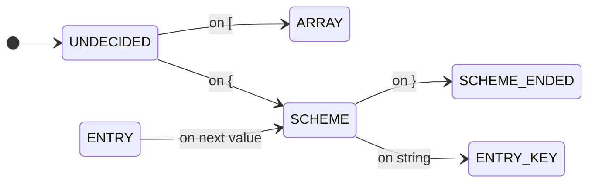

# 3.7 Extensions and Advanced Use

## 3.7.1 Using extensions

## 3.7.2 Advanced use

Why perform

* parameter validation, 
* checks for presence of mandatory settings,
* generation of parameter documentation
yourself? mConfig has a built-in facility for this and more. 

You describe all the entries your configuration can have,
and mConfig takes care of the checking. 


## 3.7.3 Data types
### 3.7.3.1 Config scheme formats
#### 3.7.3.1.1 Internal format 0: single ConfigSchemeEntry
    {
    "key":"mandatory key / configuration entry name",
    "TYPE":"mandatory type",
    "DEFAULT":"optional default value, as string",
    "DESCRIPTION":"optional description, for the documentation",
    "DESCRIPTION":{"en":"English description", "de":"Deutsche Beschreibung"},
    "PATTERN":"optional validation pattern",
    "SCOPES":[ "optional", "scopes", "this", "is", "valid", "in"],
    "FLAGS":["flags"],
    "SECRET":false,
    "HIDDEN":false
    }

Multi-language descriptions are supported by providing a map of language codes to description texts. When requested via `getDescription(Locale)`, the library will first check this map, then fall back to standard `ResourceBundle` lookup (using `.config/messages.properties`), and finally fall back to the single string description if provided.

**PLAN**: For FLAGS, in the future we may chose an alternative form - each being a pair with string
key and boolean value.

#### 3.7.3.1.2 Internal format 1:  ConfigSchemes, in an array. internal use only!
    [ 
    SCHEME_ENTRIES,
    GO_HERE,
    DEFINED_AS_IN_FORMAT_1
    ]

#### 3.7.3.1.3 Format 2: full single ConfigScheme
    {
     "name":"mandatory name the Configuration is identified by",
     "entries":[ ENTRIES_AS_DEFINED_IN_FORMAT_2 ],
    }

#### 3.7.3.1.4 Format 3: multiple full ConfigSchemes
    [
      FULL_CONFIG_SCHEME_AS_DEFINED_IN_FORMAT_3
    ]



### 3.7.4 configure priorities
#### 3.7.4.1 File Type Priority
You can control the resolution priority between different file types (e.g., JSON, YAML) using the `FILE_TYPE_PRIORITIES` feature. This re-orders the search list within each scope.

#### 3.7.4.2 Storage Type Priority

You can control the resolution priority between different storage types (e.g., Files vs. Registry) using the `STORAGE_TYPE_PRIORITIES` feature. This re-orders the search list within each scope.

```java
ConfigFactoryBuilder builder = ConfigFactoryBuilder.create("company", "app")
        .setFeature(ConfigFeature.STORAGE_TYPE_PRIORITIES, List.of("files", "registry", "registryjni", "JAR"));
try (ConfigFactory factory = builder.build()) 
        {
        // ...
        }
```
Default IDs include: `RAM`, `secrets`, `files`, `registry`, `registryjni`, `JAR`.

Additional directories provided via features like `ADDITIONAL_USER_DIRECTORIES` are typically **prepended** to the search list for their scope. This makes them the preferred location for creating new configuration files, while still allowing default files in standard locations to provide values (unless the same key is defined in the additional directory).
