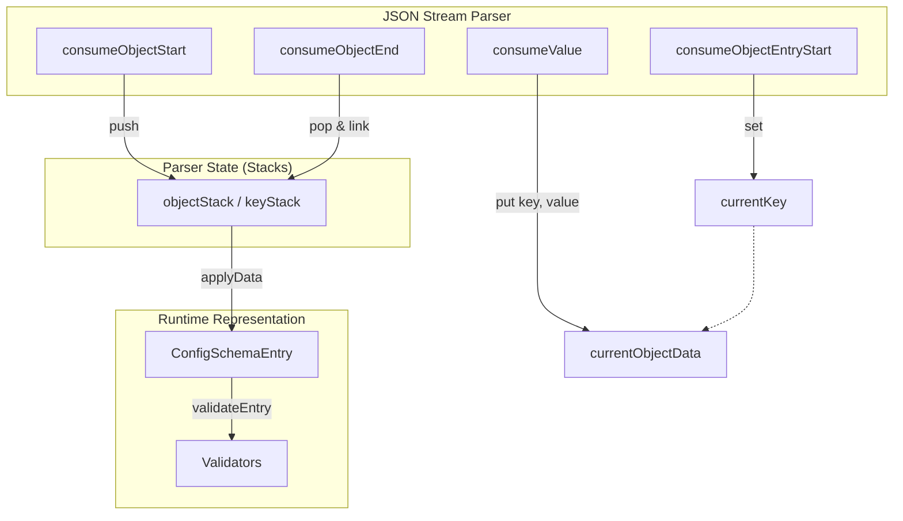
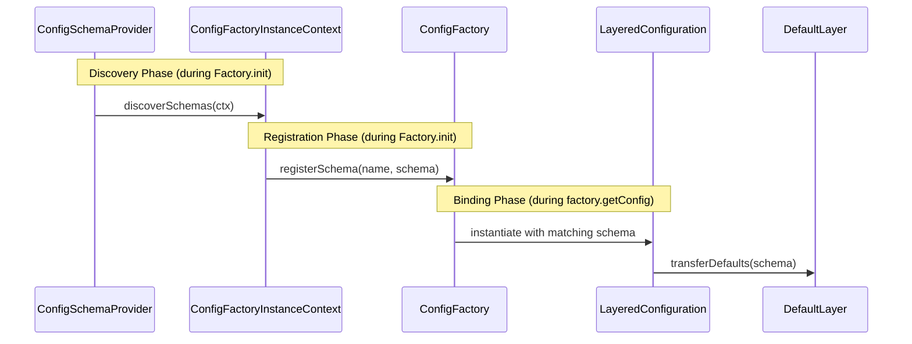

# Configuration Schemas Internals

This document details the internal architecture and implementation of Configuration Schemas in mConfig.

## 1. Architecture

Configuration Schemas are managed across multiple modules to ensure a clean separation between core interfaces and implementation details.

### 1.1 Module Separation

- **`mConfigCore`**: Contains the core interfaces (`ConfigSchema`, `ConfigSchemaEntry`) and the `ConfigSchemaRepository`. It also defines the `ConfigSchemaProvider` and `ConfigSchemaFactory` SPIs.
- **`mConfigSchema`**: The primary implementation module. It provides `DefaultConfigSchemaFactory`, `JsonConfigSchemaParser`, and the default implementations for `ConfigSchema` and `ConfigSchemaEntry`. It depends on `mConfigCore`.
- **`mConfigSource*`**: Specific modules (like `mConfigSourceJAR` and `mConfigSourceFilesystem`) implement `ConfigSchemaProvider` to discover schemas in their respective storage types.

### 1.2 Components

- **`ConfigSchema`**: Represents a collection of configuration specifications for a specific configuration name.
- **`ConfigSchemaEntry`**: Defines the contract for a single configuration key, including its type, default value, and validation rules.
- **`ConfigSchemaRepository`**: A central registry for discovered and manually registered schemas, held within the `ConfigFactoryInstanceContext`.
- **`ConfigSchemaProvider`**: SPI for discovering schemas during factory initialization.
- **`ConfigSchemaFactory`**: SPI for programmatically creating schemas and entries.
- **`JsonConfigSchemaParser`**: Handles parsing of schema files in JSON format using a streaming approach.

### 1.3 Immutability
- `ConfigSchemaImpl` `lut` made unmodifiable after `init()`.
- `addSchemaEntry` methods throw `UnsupportedOperationException` after `init()`.

## 2. Parsing and State Management

The `JsonConfigSchemaParser` uses a streaming approach (via `JsonStreamParser`) to efficiently process schema files.

### 2.1 Stack-Based State Management

The `MultiFormatConfigSchemaParser` (an internal class of `JsonConfigSchemaParser`) employs a stack-based approach for tracking keys, objects, and arrays. This is essential for supporting hierarchical JSON structures, such as the `MANDATORY` block or nested entries.

- **`keyStack`**: Keeps track of the nested keys as the parser descends into the JSON structure.
- **`objectStack`**: Maintains a stack of `Map<String, Object>` representing nested objects.
- **`arrayStack`**: Maintains a stack of `List<Object>` representing nested arrays.

When the parser encounters the start of an object or array, it pushes the current state onto the stacks. At the end of the structure, it pops the state and links the completed child structure to its parent.

### 2.2 Hierarchical Parsing Flow (Mermaid)



## 3. Validation Framework

mConfig uses a modular validation system within `ConfigSchemaEntry`.

### 3.1 Specialized Validators

- **`RangeValidator`**: Handles numeric range validation (e.g., `[1024, 65535]`) and type-based aliases (e.g., `uint16`, `int32`).
- **`EnumValidator`**: Validates against a set of allowed string values (pipe-separated).
- **`FilePathValidator`**: Performs filesystem-specific checks (`EXISTS`, `IS_DIRECTORY`, `IS_FILE`, `CAN_WRITE`).
- **`TemporalValidator`**: Handles `DATE`, `TIME`, and `DATETIME` validation, including `AFTER`, `BEFORE`, and `REQUIRE_OFFSET` flags. Support for `now` alias.
- **`PortValidator`**: Specialized `RangeValidator` for TCP/UDP ports [0, 65535] (`"validationPattern": "port"`).
- **`EmailValidator`**: Regex for common emails; simple, not full RFC (`"email"`).
- **`DurationValidator`**: `DURATION` type via `Duration.parse` (`"duration"`).
- **`SizeValidator`**: `NUMBER` size units (KB/MB/GB decimal, KiB/MiB/GiB binary) to bytes (`"size"`).

### 3.2 JSON Usage Examples

```json
[
  {
    "key": "server.port",
    "type": "NUMBER",
    "validationPattern": "port"
  },
  {
    "key": "contact.email",
    "type": "STRING",
    "validationPattern": "email"
  },
  {
    "key": "session.timeout",
    "type": "DURATION",
    "validationPattern": "duration"
  },
  {
    "key": "buffer.size",
    "type": "NUMBER",
    "validationPattern": "size"
  }
]
```

## 4. Future-Proofing (MANDATORY Block)

The `MANDATORY` block is a critical feature for forward compatibility.

### 4.1 Mechanism

During parsing, any key encountered inside a `MANDATORY` block is checked against a list of `knownMandatoryKeys` in `JsonConfigSchemaParser.ConfigSchemaSetter.applyData`.

- Currently known mandatory keys include: `EXISTS`, `IS_DIRECTORY`, `IS_FILE`, `CAN_WRITE`, `AFTER`, `BEFORE`, `REQUIRE_OFFSET`, `SCHEME`, `REQUIRE_PATH`.
- If a key is unknown, the `hasUnknownMandatoryFeatures` flag is set on the `ConfigSchemaEntry`.
- When the entry is processed in `processEntry`, a `RuntimeException` (or specialized `ConfigException`) is thrown if this flag is set.

This ensures that older versions of the library do not proceed with a configuration if they cannot fulfill a requirement that the schema designer marked as essential.

## 5. Discovery Mechanism

Schemas are discovered by `ConfigSchemaProvider` implementations (like `ClasspathConfigSchemaProvider`) during the initialization phase.

1.  **Scanning**: The provider scans for files matching `*.mconfig-schema.json` in designated directories (e.g., ".config/").
2.  **Registration**: Discovered schemas are registered with the `ConfigSchemaRepository`.
3.  **Binding**: When `getConfig(name)` is called, the factory looks up the matching schema and binds it to the resulting `Configuration` object, also populating the `DefaultLayer`.

### 5.1 Discovery and Binding Flow (Mermaid)



## 6. Export Mechanism

The `ConfigSchemaExporterComponent` (in `mConfigSourceFilesystem`) allows exporting all registered schemas to a local filesystem directory.

- **Trigger**: Activated by setting `ConfigFeature.EXPORT_SCHEMA_TO_LOCAL_STORAGE` to `true`.
- **Location**: Default is `~/.config/mconfig/schemas` (Linux) or `%APPDATA%\mconfig\schemas` (Windows), unless overridden by `ConfigFeature.LOCAL_SCHEMA_DIRECTORY`.
- **Layout**: Schemas are exported under `[<company>/]<application>/<configName>.mconfig-schema.json` (company omitted if blank/null/whitespace).
- **Format**: Schemas are exported as `.mconfig-schema.json` files.

This feature is designed to support external tools like CLI validators or IDE plugins that need access to the application's configuration contract.

## 7. Recent Changes
- **Modularity**: Split schema implementation into `mConfigSchema` module.
- **SPI Discovery**: Introduced `ConfigSchemaProvider` for decentralized schema discovery.
- **Central Repository**: Unified schema management via `ConfigSchemaRepository`.
- **Legacy Removal**: Condensed string format support fully removed. No production usages; tests JSON-based.
- **Immutability**: `ConfigSchemaImpl` `lut` unmodifiable post-`init()`. `addSchemaEntry` throws `UOE` after.
- **Programmatic Loading**: `ConfigFactoryBuilder.addSchemaJson(String jsonSchema)` parses/merges schemas during `build()`, no impl exposure.
- **New Validators**: `PortValidator` (NUMBER ports), `EmailValidator` (STRING emails, improved regex), `DurationValidator` (DURATION), `SizeValidator` (NUMBER/STRING sizes w/ units decimal/binary).
