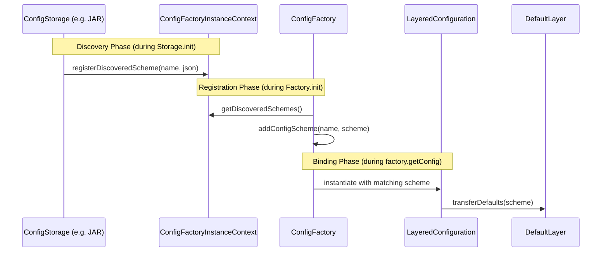
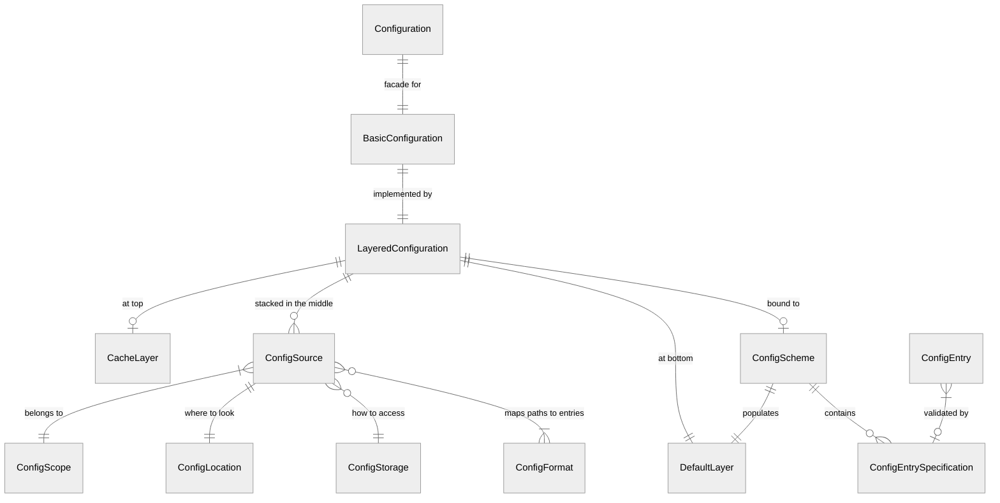

# mConfig consolidated design document

## 1. Overview
mConfig is a modular configuration library for Java, designed for flexibility, 
extensibility, and standardized configuration management 
across different operating systems and environments.

### 1.1 Multi-Platform Portability Goal
While the primary implementation is in Java, mConfig is designed 
with future ports to other languages (e.g., C, Rust, Python) in mind.
- **Abstraction over Platform Specifics**: Core logic (in `mConfigCore`) MUST 
remain agnostic of specific packaging formats (like JARs) or environment-specific APIs (like Java ClassLoaders).
- **Module Isolation**: Platform-specific logic (e.g., scanning Java classpath for resources)
must be isolated in dedicated modules (like `mConfigSourceJAR`).
- **Standardized Interfaces**: Use generic interfaces for discovery and storage
to ensure that the core behavior can be mirrored in other language environments
without significant architectural changes.

### Core Architectural Principle: Layered Stack
Configurations are resolved through a stack of layers, prioritized by scope specificity.
**Cache (optional) -> Found Sources (ordered by scope) -> Defaults**

## 2. Scopes and Priority
Scopes define the visibility and precedence of configuration data.

| Scope        | Description                                                         | Priority    |
|--------------|---------------------------------------------------------------------|-------------|
| POLICY       | Enforced policy settings (e.g., GPO), overriding everything else.   | 1 (Highest) |
| RUNTIME      | Volatile, in-memory settings for the current process.               | 2           |
| SESSION      | Specific to the current user session or working directory.          | 3           |
| USER         | Personal settings for the current user (e.g., `~/.config/`).        | 4           |
| APPLICATION  | Settings specific to the application installation/portable root.    | 5           |
| HOST         | Host / OS instance settings (e.g., `/etc/`, Windows Registry HKLM). | 6           |
| CLUSTER      | Settings for a cluster of hosts.                                    | 7           |
| CLOUD        | Cloud-based configurations, shared across multiple clusters.        | 8           |
| ORGANIZATION | Settings shared across an organization/licensee.                    | 9           |
| PRODUCT      | Hardcoded defaults provided by the application or modules.          | 10 (Lowest) |

**Tie-breaking within the same scope:** Later-added layers take precedence over earlier-added ones.

### 2.1 Storage Type Priority
Resolution priority between different storage types (within the same scope) is deterministic.

**Default Order (Highest to Lowest):**
1. `RAM` (In-memory overrides)
2. `secrets` (Encrypted/sensitive data)
3. `files` (Local filesystem)
4. `registry` (Windows Registry - JNR-FFI)
5. `registryjni` (Windows Registry - JNI)
6. `zookeeper` (ZooKeeper - Experimental, Self-configuring)
7. `JAR` (Classpath resources/defaults)

This order can be customized via `STORAGE_TYPE_PRIORITIES` (List of IDs) and `STORAGE_TYPE_ALLOW_ALL_STORAGES` (Boolean).

## 2.2 Self-Configuration
mConfig supports "self-configuration" to allow the library to configure 
its own behavior using the same discovery mechanisms it provides to applications.

### 2.2.1 Library Self-Configuration (ConfigFactorySettings)
When the `mConfigSourceJAR` module is present, mConfig automatically searches
for a properties file named `mconfig.properties` in the following classpath location:
`.config/metabit/mConfig/mconfig.properties`

This file is used to populate `ConfigFactorySettings` during the 
`ConfigFactory` initialization. It supports setting any `ConfigFeature`.
(Thus, handle with care; it is as powerful as its code counterparts.)

*   **Discovery**: It uses `ClassLoader.getResources()` to find 
*all* occurrences of this file in the classpath,
allowing settings to be provided from multiple JARs or resource paths.
*   **Format**: Standard Java `.properties` format only.
Keys (ignoring case) are matched against `ConfigFeature` constants.
*   **Disabling**: This feature is enabled by default for convenience, but can be disabled via `ConfigFeature.ENABLE_SELF_CONFIGURATION = false` for environments with strict classpath security requirements.

### 2.2.2 Networked Source Self-Configuration
Networked sources (like ZooKeeper) can also retrieve their own connection settings (connect string, root path, etc.) from previously loaded layers (e.g., JAR defaults or local filesystem overrides).

**Resolution Order during Startup:**
1.  **Core Discovery**: Modules (Storages, Formats) and `ConfigFactoryComponent`s are identified.
2.  **Library Self-Configuration**: `SelfConfigurationComponent` (from `mConfigSourceJAR`) is initialized, populating `ConfigFactorySettings` from `mconfig.properties`.
3.  **Local Source Initialization**: `JARConfigSource` and `FileConfigStorage` are initialized based on `STORAGE_TYPE_PRIORITIES`.
4.  **Networked Source Initialization**:
    - `ZooKeeperConfigStorage.init()` is called.
    - It requests its own configuration (default name: `"zookeeper"`) from the factory via `ctx.getFactory().getConfig("zookeeper")`.
    - If settings are found in JAR defaults or local files, it connects and registers its locations (e.g., `CLUSTER`, `ORGANIZATION`).
    - If settings are missing, it remains inactive (zero-config support).
5.  **Finalization**: The factory is ready, including any successfully activated networked layers.

See [ZooKeeper Example](examples/zookeeper.md) for detailed configuration snippets.

## 3. Core Components

### ConfigFactory
The main entry point. It manages the `ConfigSearchList` and instantiates `Configuration` objects.

### ConfigSearchList
A prioritized list of `ConfigLocation` entries defining where the library should look for configurations.

### ConfigLocation & ConfigSource
- **ConfigLocation**: Defines *where* a configuration might be found (Storage + Handle + Scope).
- **ConfigSource**: An instantiated `ConfigLocation` that is associated with a specific `ConfigLayer`. It confirms the configuration exists and is readable.

### ConfigStorage
Provides low-level access to data (e.g., `FileConfigStorage`, `WindowsRegistryConfigStorage`, `EnvVarConfigStorage`).

### ConfigFormat
Parses and writes data in specific formats (e.g., `Properties`, `JSON`, `YAML`, `TOML`, `JSON5`, `INI`). It is responsible for instantiating `ConfigLayer` objects.

### ConfigLayer
A concrete instance of configuration data from a `ConfigLocation`. It maps hierarchical keys (e.g., `database/host`) to `ConfigEntry` objects.

### ConfigEntry
A leaf node in the configuration tree, containing the value and metadata (like the source location).

## 4. Operational Modes

### TEST_MODE
- Bypasses standard OS locations.
- Uses only explicitly provided test paths (via `TESTMODE_DIRECTORIES` feature) and standard test resources.
- `TESTMODE_DIRECTORIES` entries support the `SCOPENAME ":" PATH` format.
- Prevents tests from interfering with or relying on actual user configurations.
- **Security**: Employs a two-tier gate system (Global Static Gate + Instance Dynamic Gate). `PERMIT_TEST_MODE` defaults to `true` ("Productive by Default") but can be locked down per instance.

### ADDITIONAL_DIRECTORIES
- `ADDITIONAL_RUNTIME_DIRECTORIES` and `ADDITIONAL_USER_DIRECTORIES` allow adding custom search paths at runtime.
- Support the `SCOPENAME ":" PATH` format, allowing paths to be assigned to any scope (not just their default scope).
- Prepended to the search list of their respective scope, ensuring they take precedence over default locations.

### SERVICE-mode (Auto-refresh & Monitoring)
- If enabled, every access re-checks the search list for new or updated configuration files.
- Recommended to be used with a **Cache Layer** to mitigate performance overhead.
- Cache entries should have a configurable TTL (Time-To-Live).
- **Monitoring Support**: `Configuration` supports the `subscribeToUpdates(Consumer<ConfigLocation>)` mechanism. 
  This is used by the `monitor` CLI command to provide real-time reporting of changes.

### 4.2 Self-Configuration Security
Self-configuration (see section 2.2.1) automatically applies settings from the classpath. In environments where the classpath might contain untrusted JARs, this feature can be disabled:
```java
ConfigFactoryBuilder.create("metabit", "APP")
    .setFeature(ConfigFeature.ENABLE_SELF_CONFIGURATION, false)
    .build();
```
Disabling self-configuration ensures that the `ConfigFactory` starts with only the settings explicitly provided in code, preventing "configuration injection" via the classpath.

## 5. Reading and Writing

### Reading
- Sequential search from most specific to least specific scope.
- Value conversion (String to Integer, Boolean, etc.) is handled at the `Configuration` facade level.

### Writing
- **Direct Write**: Attempt to write back to the `ConfigLocation` where the entry was found.
- **Scope-based Write**: Specify a scope for the write operation.
- **Write Fallback (Fall-forward)**: If writing to the preferred location fails, attempt to write to a more specific scope (e.g., if MACHINE is read-only, write to USER).
- **Write Cache**: Optional layer that buffers writes until a `flush()` is called.

## 6. Security and Secrets
mConfig provides specialized handling for sensitive data (API keys, passwords, certificates).

### 6.1 Secret Entries
- Sensitive data should be handled via `SecretValue` and `SecretConfigEntryLeaf`.
- Values are obfuscated in memory (`char[]` or `byte[]` instead of `String` where possible).
- `toString()` implementation of secret entries is automatically redacted (`[REDACTED]`).
- `ConfigFacadeImpl.getSecret(key)` is the preferred API to retrieve a `SecretValue`.

### 6.2 Scheme-Driven Secrets
A `ConfigEntry` is treated as a secret if its `ConfigEntrySpecification` (from a `ConfigScheme`) has the `SECRET` flag set.
- `ConfigEntryFactory` automatically creates a `SecretConfigEntryLeaf` if the scheme marks the key as a secret.
- **Intelligent Type Selection**: When creating a secret entry, the factory chooses a `SecretType` (e.g., `PLAIN_TEXT` vs `SYMMETRIC_KEY`) based on the requested `ConfigEntryType`.

### 6.3 External Secrets Providers
External authentication (e.g., towards networked sources like HashiCorp Vault) 
can be integrated via specialized modules implementing `ConfigSecretsProviderInterface`.
- Secret providers are initialized during the configuration loading phase.
- They can receive a `ConfigurationPhaseWrapper` to access 
partially loaded configurations for their own initialization
(e.g., to read the Vault address from a local file).

## 7. Format Specifics

### Java .properties
- Flat key-value pairs. Trims whitespace.
- Supports multi-line values with `\`.

### JSON / JSON5
- Toplevel must be an Object or Array.
- JSON5 adds support for comments, trailing commas, and unquoted keys.

### YAML
- Supports hierarchical structures.
- Implementation must ensure secure parsing (avoiding arbitrary command execution).

### INI
- Section-based (`[section]`).
- Hierarchical keys can be mapped to sections using `/` (e.g., `[first/second]`).

### 7.7 Writing Priorities
When writing to a configuration (e.g., via `put`), mConfig applies the following priorities within the requested scope(s):

1. **Priority 1: Update Existing Entry.** The highest-priority writeable layer in the scope that already contains the key is updated.
2. **Priority 2: Add to Existing Layer.** If the key is new to the scope, it is added to the highest-priority writeable layer already instantiated in that scope.
3. **Priority 3: Create New Layer.** If no writeable layers exist for the scope, mConfig attempts to create a new one using the prioritized `ConfigStorage` and `ConfigFormat` settings.

Writes are strictly scope-isolated unless `WRITE_FALLBACK_ACROSS_SCOPES` is enabled. For multi-scope writes, mConfig iterates from the most specific to the most generic scope, stopping at the first successful write.

## 8. BLOBs (Binary Data)
mConfig supports Binary Large Objects (certs, licenses, keys) in two distinct ways:

### 8.1 Hierarchical BLOBs (Keyed Leaves)
In hierarchical formats like JSON and YAML, binary data can exist as a leaf node with a specific key (e.g., `server/certificate`).
- **YAML**: Native support via the `!!binary` tag.
- **JSON**: Supported via Base64 encoding. If a `ConfigScheme` marks a key as `BYTES`, the JSON format will automatically decode the Base64 string into a `BlobConfigEntryLeaf`.
- These entries are part of the regular configuration tree and can be accessed via `getValueAsBytes()`.

### 8.2 Flat BLOBs (Opaque Files)
Entire files can be treated as a single binary blob using the `FileRawBinaryFormat` (extension `.bin`).
- These are **opaque** and have no internal structure.
- The entry is always accessed using the empty string key (`""`).
- Requesting any other key from a flat binary layer will return `null`.

## 9. Crypto Library Interaction
mConfig is designed to work seamlessly with standard Java crypto libraries (JCE) and third-party libraries like BouncyCastle.

- **JCE Integration**: `SecretValue` can store raw bytes of `PrivateKey`, `PublicKey`, or `SecretKey`. Conversion typically involves `key.getEncoded()`.
- **BouncyCastle**: Can be used to process `SecretValue` contents (e.g., parsing a PEM-encoded certificate stored as a `BYTES` entry).
- **Test Strategy**: Integration tests (`SecretsJCETest`, `SecretsBCTest`) verify that low-level binary secrets are preserved exactly as they move through the configuration stack.

## 10. Configuration Schemes
Configuration Schemes define the contract for a set of configuration entries, specifying keys, types, defaults, and validation rules.

See the detailed **[Configuration Schemes](configuration-schemes.md)** for information on:
- Scheme structure and properties
- Future-proofing with the `MANDATORY` block
- JSON format variants
- Discovery and registration via `ConfigSchemeRepository`

### 10.1 Discovery and Precedence
Schemes are automatically discovered from the classpath (specifically within `.config/` directories) if the `JARConfigSource` is active.

- **Unified Discovery:** Discovery is performed across all classpath resources, including both `main` and `test` resource directories.
- **Precedence:** If multiple scheme files for the same configuration name are discovered, a "Last-One-Wins" strategy is applied based on the order returned by the `ClassLoader`. In typical development environments (Maven/Gradle), this means production resources might overwrite test resources if they appear later in the classpath enumeration.
- **Scope Agnosticism:** Unlike configuration data (layers), schemes are not scope-isolated in `TEST_MODE`. Production schemes are always loaded to ensure a consistent contract.

### 10.2 Discovery and Binding Flow (Mermaid)
The following diagram illustrates how schemes are discovered by storages, registered in the factory, and finally bound to configuration instances.



### Layered Configuration (Mermaid)


## 11. Extending mConfig
### 11.1 Adding New Storages
This is intended for library maintainers extending mConfig with new backends (e.g., databases, cloud stores).

When implementing a new `ConfigStorage`:

1.  **Module Creation**: Create `mConfigSource<Name>` module with `ConfigStorageInterface` impl.
2.  **init(ctx)**: Populate `ctx.getSearchList()` with `ConfigLocationImpl` for scopes/formats/paths.
3.  **Read Layers**: In `tryToReadConfigurationLayers`, load/parse entries into `LayeredConfiguration`.
4.  **Classpath Order**: Auto-discovered; control via `ConfigFeature.STORAGE_TYPE_PRIORITIES`.
5.  **Testing**: Add unit/integration tests; verify with full `mvn clean test`.

Examples: `FileConfigStorage`, `JARConfigSource`, `WindowsRegistryConfigSource`.

In case a specific config format is to be supported as well, it can go into the same module.

### 11.2 Adding New ConfigFeatures
This is not for library consumers; only project owners should need to perform this step.

When adding a new constant to the `ConfigFeature` enum in `mConfigCore`, you MUST perform the following steps to ensure technical consistency and avoid runtime errors:

1.  **Enum Constant**: Add the new constant to the `ConfigFeature` enum.
2.  **Type Initialization**: In the `static` initialization block of `ConfigFeature`, you MUST assign a `ValueType` to the `valueType` field of the new constant.
    *   Example: `REGISTRY_BASE_PATH.valueType = ValueType.STRING;`
3.  **Default Values (Optional)**: If the feature should have a default value, assign it to the `defaultValue` field in the same `static` block.
    *   Example: `MY_FEATURE.defaultValue = Boolean.TRUE;`
4.  **Verification**: Run the `ConfigFeatureTypesTest` unit test to ensure that all features have a valid type assigned. A missing type will cause a `NullPointerException` when the feature is accessed via `ConfigFactorySettings`.

## 5. Best Practices

### Classpath Layout
- **Production Defaults**: `src/main/resources/.config/&lt;company&gt;/&lt;app&gt;/&lt;config&gt;.&lt;ext&gt;` (JARConfigSource).
- **Test Mode**: `src/test/resources/.config/&lt;company&gt;/&lt;app&gt;/` + `config/{SCOPE}` (overrides project).
- **Schemes**: Same path + `.scheme.json`.

### Logging
- Implement `ConfigLoggingInterface` for structured logs (SLF4J/JUL/Logback).
- **Avoid**: `System.out.println` (blocks UI/threads).
- Secrets auto-redacted.

### Secrets Handling
- Retrieve: `SecretValue sv = config.getSecret(key)` (scheme-marked SECRET).
- Use: `byte[] data = sv.getValue()`; `sv.erase()` post-use (secure wipe).
- Storage: Formats preserve `SecretValue`; logs masked.

See [Handling Secrets](handling-secrets.md).