# mConfig Documentation

mConfig is a modular Java library for unified, portable configuration management. It abstracts OS-specific locations (e.g., `~/.config/`, `/etc/`, Windows Registry), multiple sources (files, env vars, JAR resources, ZooKeeper), and formats (JSON, YAML, TOML, Properties, etc.).
The [mConfig Tool](41_mconfig_tool.md) is a powerful companion for exploring and managing these configurations from the command line.

**Core Principle**: Layered resolution stack prioritizes scopes (highest first):

```mermaid
graph LR
  POLICY[POLICY<br/>Enforced/GPO] --> RUNTIME[RUNTIME<br/>Volatile RAM]
  RUNTIME --> SESSION[SESSION<br/>Env/CLI]
  SESSION --> USER[USER<br/>~/.config/]
  USER --> APPLICATION[APPLICATION<br/>Portable/Install]
  APPLICATION --> HOST[HOST<br/>/etc/, HKLM]
  HOST --> CLUSTER[CLUSTER<br/>ZK/Networks]
  CLUSTER --> CLOUD[CLOUD<br/>Providers]
  CLOUD --> ORGANIZATION[ORGANIZATION<br/>Licensee]
  ORGANIZATION --> PRODUCT[PRODUCT<br/>JAR Defaults]

  classDef high fill:#ff9999
  class POLICY,RUNTIME high
```

Ties within scope: Later-added > earlier; storage prio: RAM > secrets > files > registry > JAR.

**Quick Start**: [What is mConfig?](11_what_is_mconfig.md) → [Getting Started](13_getting_started.md)

**Architecture**: [Design Consolidated](44_design_consolidated.md)

## Part 1: Introduction & Basics
- [1.1 What is mConfig?](11_what_is_mconfig.md)
- [1.2 Features and Use Cases](12_features_and_use_cases.md)
- [1.3 Getting Started](13_getting_started.md)
- [1.4 Regular Use](14_regular_use.md)
- [1.5 Test Mode](15_test_mode.md)

## Part 2: Core Concepts
- [2.1 How it Works](21_how_it_works.md)
- [2.2 Priorities and Hierarchies](22_priorities_and_hierarchies.md)
- [2.3 Configuration Schemes](23_configuration_schemes.md)
- [2.4 Comment Handling](24_comment_handling.md)
- [2.5 Config Features](25_config_features.md)

## Part 3: Advanced Topics
- [3.1 Writing Configurations](31_writing_configurations.md)
- [3.2 Updates](32_updates.md)
- [3.3 Getting Information](33_getting_information.md)
- [3.4 Definitions and Valid Values](34_definitions_and_valid_values.md)
- [3.5 Handling Secrets](35_handling_secrets.md)
- [3.6 Windows Registry Access](36_windows_registry.md)
- [3.7 Extensions and Advanced Use](37_extensions_and_advanced_use.md)
- [3.8 Code Improvements and Best Practices](38_code_improvements.md)

## Part 4: Reference & Project
- [4.1 mConfig Tool](41_mconfig_tool.md)
- [4.2 Logging](42_logging.md)
- [4.3 FAQ](43_faq.md)
- [4.4 Design Consolidated](44_design_consolidated.md)
- [4.5 AI Guidance (Notes for Code-Generating Tools)](45_ai_guidance.md)
- [4.6 Versions](46_versions.md)
- [4.7 Contributing](47_contributing.md)
- [4.8 Legal](48_legal.md)
- [Examples](examples/index.md)
- [4.9 Links and References](49_links.md)
